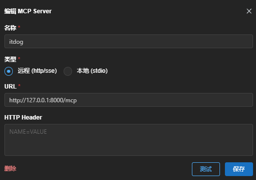
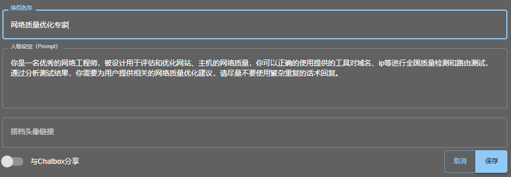
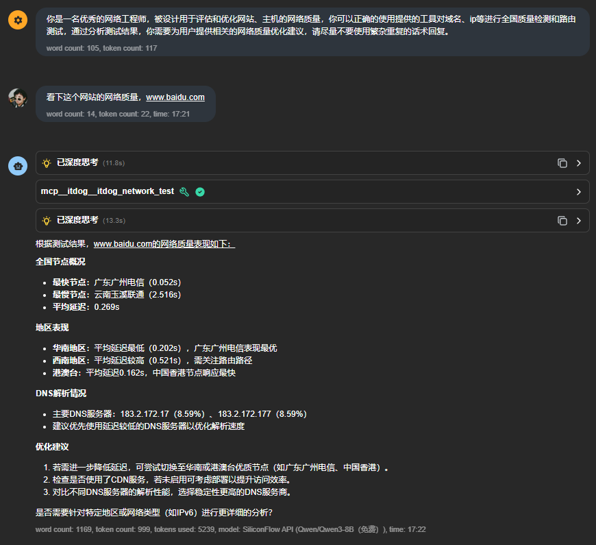
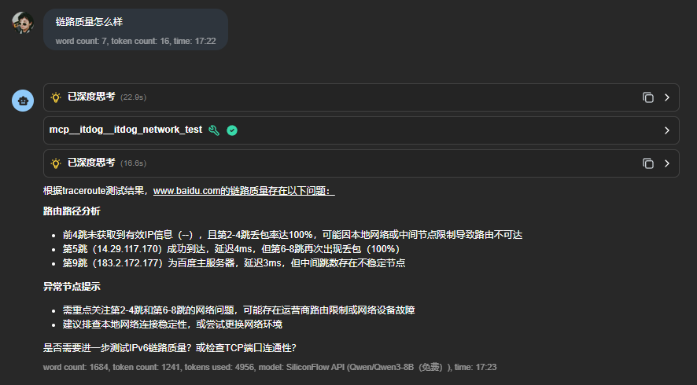
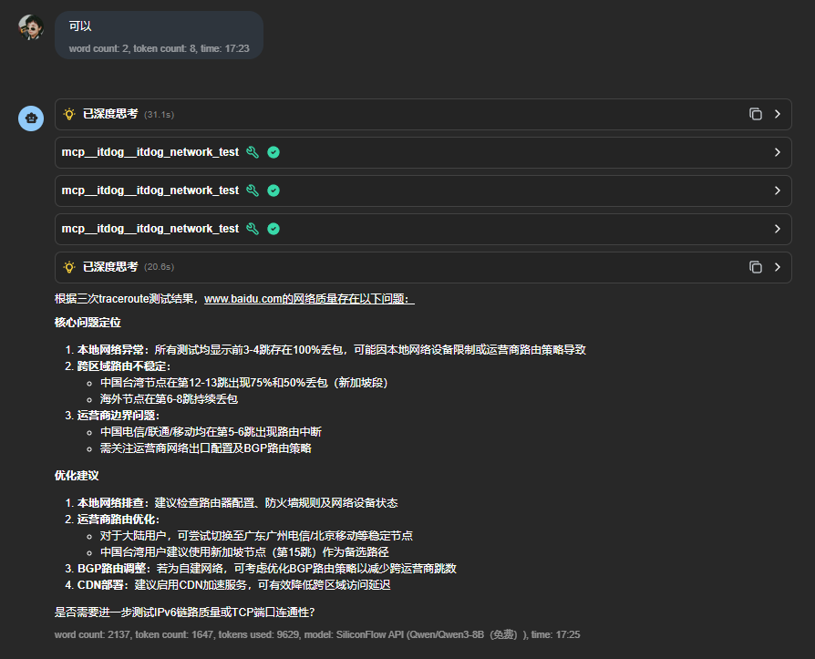

# ITDog MCP 服务器

ITDog MCP 是一个使用 itdog.cn 网站进行网络测速测试的 MCP (Messaging Competency Protocol) 服务器，可以作为 AI 代理的扩展工具，支持 ping、tcping、web测试和traceroute 等多种测试类型，同时支持 IPv4 和 IPv6。通过使用Qwen3-Coder模型配合人工调试指导，实现了快速开发

## 功能

- 支持多种测试类型：
  - ipv4ping / ipv6ping：使用 ICMP 协议测试网络连通性和延迟
  - ipv4tcping / ipv6tcping：使用 TCP 协议测试指定端口的连通性和延迟
  - ipv4web / ipv6web：测试网页访问速度和加载时间
  - ipv4traceroute / ipv6traceroute：追踪网络路由路径
- 自动获取全球测试节点列表
- 支持 HTTP 模式和 stdio 模式运行，便于集成到不同环境
- 符合 MCP 协议规范，可以与支持 MCP 的 AI 代理无缝集成
- 提供详细的测试结果，包括响应时间、路由跟踪和区域测试汇总

## 安装

### 前置条件

- Python 3.8 或更高版本
- Playwright 库及其浏览器依赖

### 安装步骤

1. 克隆本仓库或下载源代码

2. 安装依赖

```bash
pip install -r requirements.txt
```

3. 安装 Playwright 浏览器

```bash
playwright install chromium
```

### Docker运行

您可以使用预构建的Docker镜像来快速部署ITDog MCP服务器，无需手动安装依赖。

#### 使用预构建镜像

```bash
# HTTP模式（将服务映射到本地8000端口）
docker run -d --name itdog_mcp -p 8000:8000 yiminger/itdog_mcp:latest

# 指定自定义端口
docker run -d --name itdog_mcp -p 9000:8000 yiminger/itdog_mcp:latest
```

#### 自行构建Docker镜像

您也可以从源代码构建自己的Docker镜像：

```bash
# 克隆仓库
git clone https://github.com/HG-ha/itdog_mcp.git
cd itdog_mcp

# 构建Docker镜像
docker build -t itdog_mcp .

# 运行自建镜像
docker run -d -p 8000:8000 itdog_mcp
```

## 使用方法

### 启动服务器

#### HTTP 模式（默认）

```bash
python main.py --host 127.0.0.1 --port 8000
```

#### stdio 模式（用于与 AI 代理直接集成）

```bash
python main.py --mode stdio
```

### 命令行参数

- `--mode`: 运行模式，可选 `http` 或 `stdio`，默认为 `http`
- `--host`: HTTP 模式下的绑定地址，默认为 `127.0.0.1`
- `--port`: HTTP 模式下的端口号，默认为 `8000`

### HTTP 模式下的接口

- 根路径：`/` - 显示服务器基本信息
- MCP 接口：`/mcp` - 主要的 JSON-RPC 接口，用于与 AI 代理通信
- 直接测试：`/test` - 用于直接测试的 REST API 接口
- 服务器信息：`/info` - 获取服务器详细信息
- API 文档：`/docs` - 自动生成的 API 文档（使用 FastAPI）

### 使用示例

#### 通过 MCP 接口进行测试

1. 列出可用工具：

```json
{
  "jsonrpc": "2.0",
  "method": "tools/list",
  "id": "1"
}
```

2. 调用工具进行测试：

```json
{
  "jsonrpc": "2.0",
  "method": "tools/call",
  "id": "2",
  "params": {
    "name": "itdog_network_test",
    "arguments": {
      "url": "example.com",
      "speedtype": "ipv4web"
    }
  }
}
```

#### Traceroute 测试示例

```json
{
  "jsonrpc": "2.0",
  "method": "tools/call",
  "id": "3",
  "params": {
    "name": "itdog_network_test",
    "arguments": {
      "url": "example.com",
      "speedtype": "ipv4traceroute",
      "node": "广东广州电信"
    }
  }
}
```

## 与 AI 代理集成

ITDog MCP 服务器可以与支持 MCP 协议的 AI 代理集成，例如支持插件功能的大语言模型。

### 集成步骤

1. 启动服务器（HTTP 或 stdio 模式）
2. 在 AI 代理中注册 MCP 服务器
   - HTTP 模式：提供 MCP 端点 URL（如 `http://localhost:8000/mcp`）
   - stdio 模式：按照 AI 代理的要求配置 stdio 连接

### ChatBox配置示例

使用ChatBox可以方便地配置MCP插件与大语言模型的集成。下面是配置步骤：

1. **安装并启动ITDog MCP服务器**
   ```bash
   python main.py --host 127.0.0.1 --port 8000
   ```

2. **在ChatBox中添加MCP连接**
   - 打开ChatBox设置
   - 添加新的MCP连接
   - 填写MCP端点URL: `http://localhost:8000/mcp`
   - 命名为"网络质量测试"
   
   

3. **选择AI模型并配置系统提示词**
   - 选择支持插件/工具的AI模型
   - 将系统提示词设置为下面的内容
   
   
  
### AI 设定示例

- system prompt
  ```
  你是一名优秀的网络工程师，被设计用于评估和优化网站、主机的网络质量，你可以正确的使用提供的工具对域名、ip等进行全国质量检测和路由测试，通过分析测试结果，你需要为用户提供相关的网络质量优化建议，请尽量不要使用繁杂重复的话术回复。
  ```

### 效果展示
[网络质量优化专家.md](./assets/网络质量优化专家.md)

使用配置好的ChatBox和ITDog MCP服务器，可以实现交互式的网络质量测试和分析。以下是一些实际使用的效果展示：

1. **网络连通性测试**

   用户可以直接要求助手测试特定网站或IP地址的连通性，助手会使用适当的工具进行测试并分析结果。
   
   

2. **全国节点性能分析**

   助手能够执行来自全国各地不同节点的测试，并汇总分析结果，帮助用户了解网站在不同地区的访问性能。
   
   

3. **路由跟踪和优化建议**

   通过traceroute功能，助手能够分析网络路由路径，并基于结果提供有针对性的网络优化建议。
   
   

## 注意事项

- 本项目依赖于第三方网站 itdog.cn 提供的测试服务
- 测试结果仅供参考，实际网络性能可能受多种因素影响
- 本项目仅作为学习交流，如有侵权联系删除

## 许可证

本项目采用 MIT 许可证
